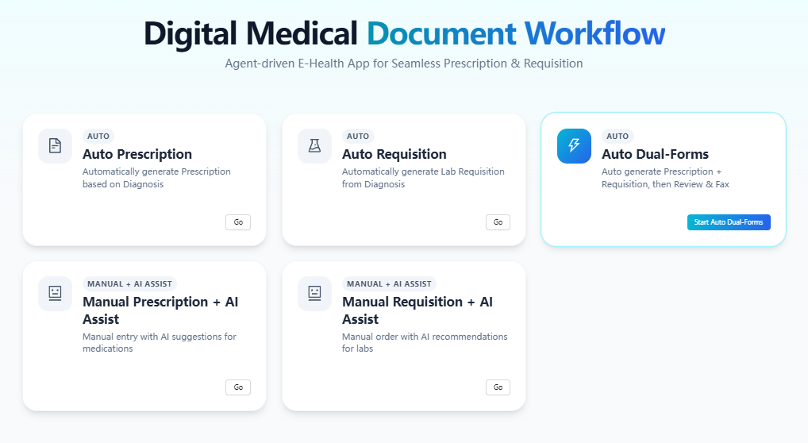
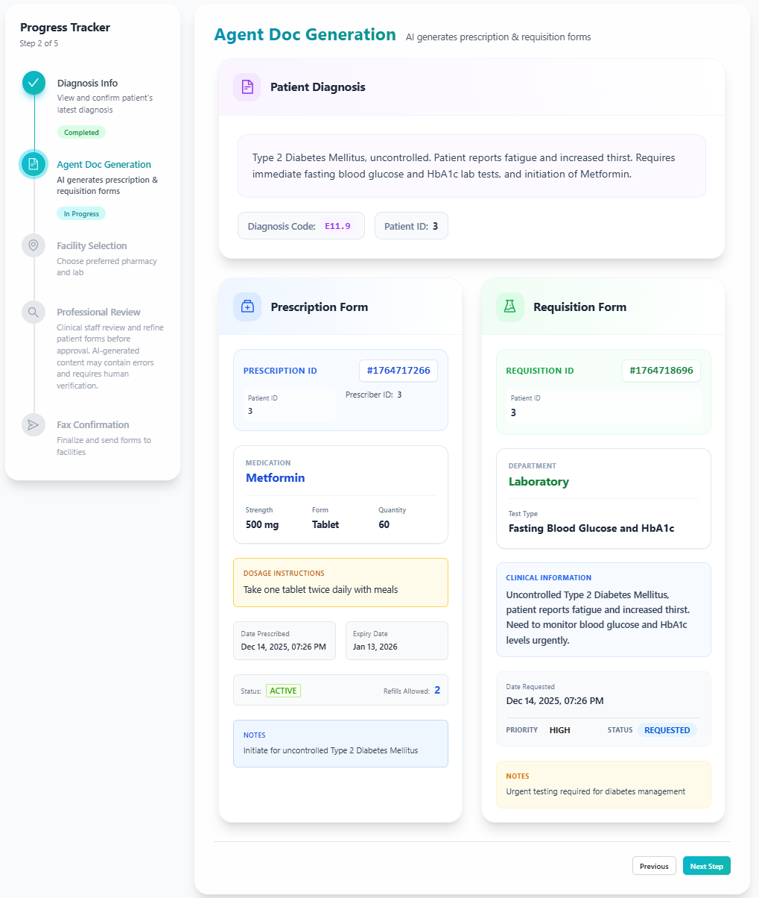
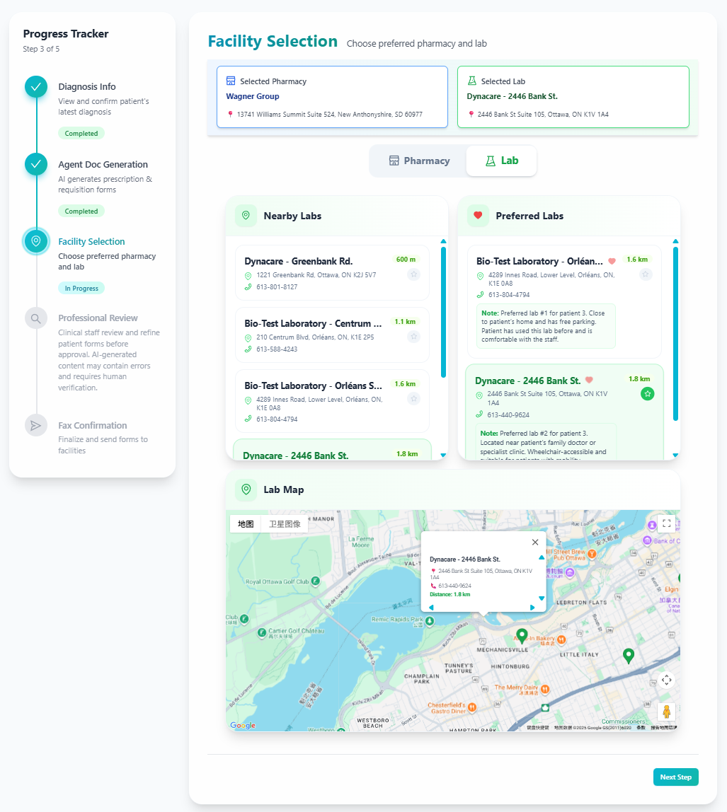
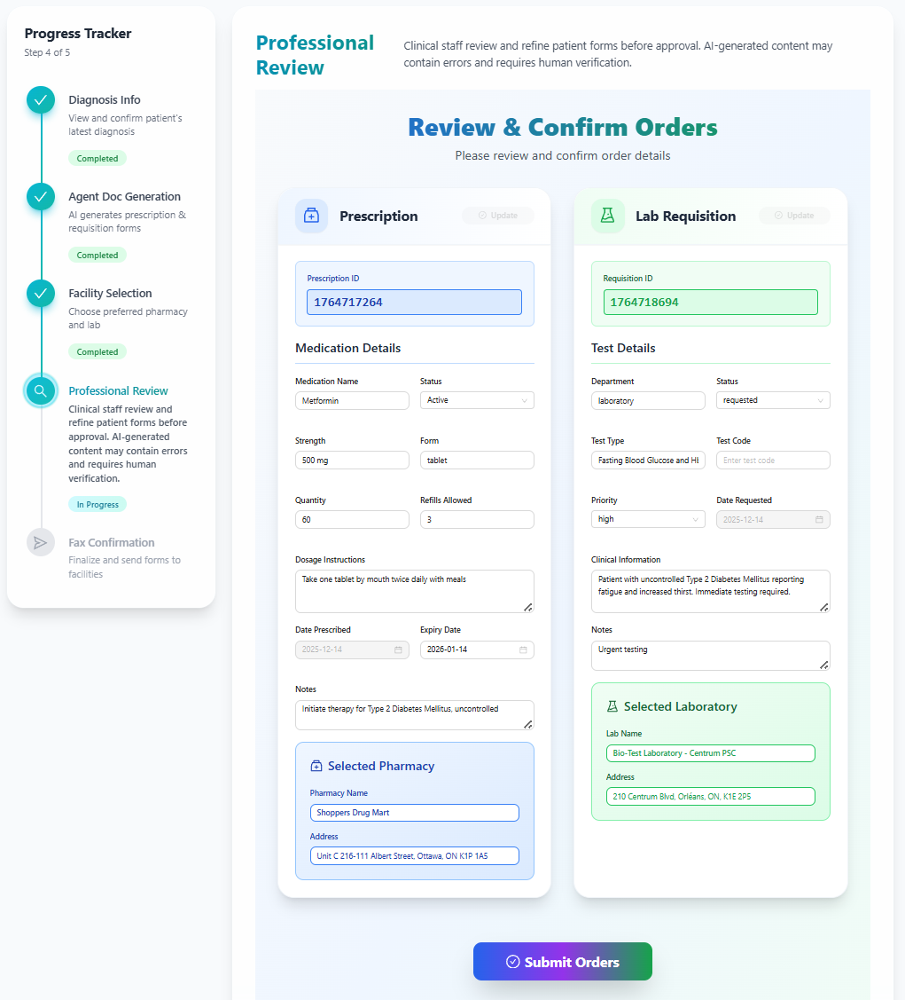
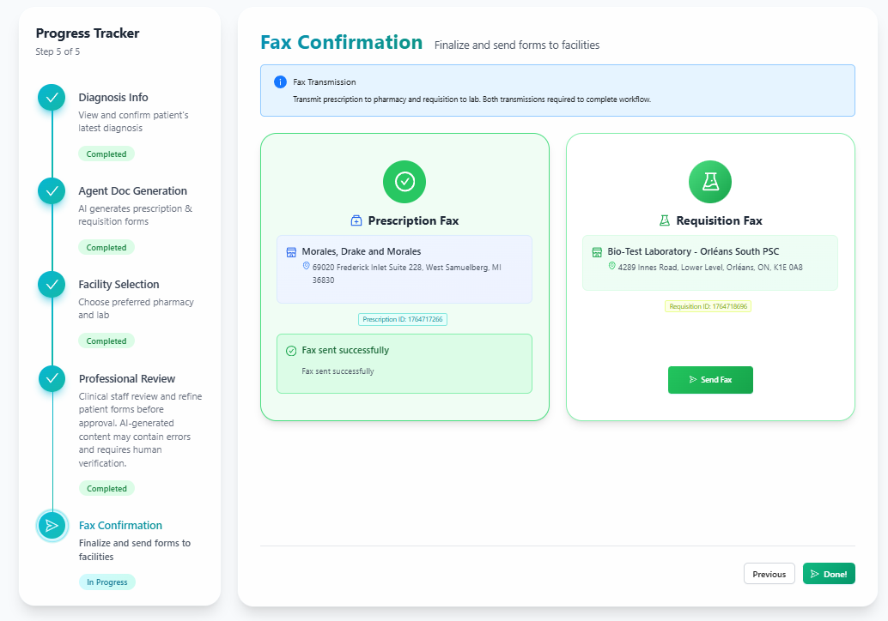

# 🏥 AI-Agent Driven Clinical Document Workflow System

This project is part of the **eHospital / eHealth project** (https://www.e-hospital.ca/) and focuses on automating the **generation, review, and distribution of clinical documents** using an AI-agent-driven workflow.

The system operates **after a diagnosis has been generated** and converts clinical reasoning into **actionable medical documents**, including prescriptions and laboratory requisitions.

This system supports **five clinical workflows** designed for different medical scenarios, ranging from fully automated document generation to manual workflows with AI-assisted completion.

As part of a larger eHospital pipeline, the system represents **Agent 3** in a three-agent workflow:
- **Agent 1** collects patient information,
- **Agent 2** generates clinical diagnoses,
- **Agent 3** transforms diagnoses into executable clinical documents and handles review and distribution.

---

## ✨ Project Highlights

- 🤖 **Agent-driven document generation** using OpenAI Function Calling  
- 📄 Automated creation of **Prescription** and **Lab Requisition** forms  
- 🔄 Multiple workflows supporting different clinical scenarios  
- 🗺️ **Google Maps integration** for pharmacy and lab selection  
- 👩‍⚕️ **Human-in-the-loop review** before final submission  
- 🧩 Modular design, easy to integrate with upstream systems  

---

## 🧠 System Overview

This module represents the **document generation and distribution stage** of a larger eHospital workflow.  
It is designed to be deployed independently while integrating seamlessly with other systems via a shared database and URL-based handoff.

---

## 🖥️ Demo Screenshots

### Workflow Home


### Document Generation


### Facility Selection


### Professional Review


### Fax Confirmation


---

## 🧩 Tech Stack

### Backend
- **FastAPI** (Python)
- OpenAI Function Calling (Agent Orchestration)
- Pydantic (Schema Validation)

### Frontend
- **React** (Single-Page Application)
- Google Maps API (Facility Location)

### Database
- Shared existing **AWS-hosted cloud database** 
- No local database setup required

---

## 🚀 How to Run the Project

### 1️⃣ Backend Setup (FastAPI)

```bash
cd backend
python -m venv .venv
source .venv/bin/activate   # Windows: .venv\Scripts\activate
pip install -r requirements.txt
```
Create a `.env` file in the **backend root directory**:
```env
OPENAI_API_KEY=your_openai_api_key_here
```
Run the FastAPI server:
```bash
uvicorn main:app --reload
```
The backend will run at:
```
http://127.0.0.1:8000
```
### 2️⃣ Frontend Setup (React Portal)
```bash
cd portal
npm install
```
Create a `.env` file in the portal root directory:
```env
VITE_GOOGLE_MAPS_API_KEY=your_google_maps_api_key_here
VITE_BASE_URL=http://localhost:8000/api
```
Start the frontend development server:
```bash
npm run dev
```
The portal will be available at:
```
http://localhost:5173
```
---
## 📘 API Documentation

API documentation and request examples are available in the root directory:

- 📄 [API Documentation (English)](api_doc.md)
- 📄 [API Documentation (中文)](api_doc_CN.md)

These materials are intended for:
- Understanding backend endpoints
- Secondary development
- System integration or extension

---

## 📌 Project Context

This project was developed as part of:

**ELG6131 – eHealth, mHealth & Telemedicine**

It represents the clinical document automation module within a multi-team eHospital system, with a focus on:
- Agent-driven workflow automation
- Clinical document generation and distribution
- System integration and modular design
- Human-in-the-loop AI usage

---

## ⚠️ Disclaimer

This project is for educational and demonstration purposes only.  
It is not intended for real clinical use without proper medical validation and regulatory approval.

---

## 🧪 Early Prototype (SpringAI Version)

An earlier backend prototype of this project was implemented using **Spring Boot and SpringAI** as part of initial architectural exploration.

The prototype repository is available here:
- 🔗 https://github.com/MiziClare/ai-agent-driven-clinical-document-workflow

This version is preserved for reference and comparative development purposes.


